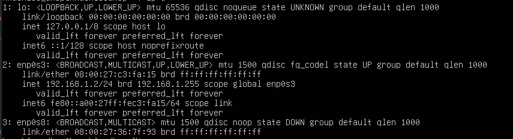

# DHCP

Pour le service DHCP j'ai choisi un **Ubuntu Live server 24.04 LTS** comme serveur principal puis `isc-dhcp-server` comme service dhcp. Ci-dessous il y aura la configuration en partant de zéro.

## Interfaces & Réseaux

Faut determiner d'abord l'interface souhaitée, celle qui recevra les requetes ARP:

```bash
    ip a
```

devra montrer :



avec cette information on peut deternminer le nom de ml'interface, son etat : `UP` ou `Down`, ainsi que son addresse MAC et **possible addresse IP**, dans ce cas :

- **Nom** : `enp0s8`
- **MAC** : `08:00:27:36:7f:93`
- **Etat** : `Down`
- **IP** : vide

Maintenant faut conecter le seveur a internet via cette interface, je prend enp0s8 comme exemple. pour cela, deux moyen, activer le dhcp, ou utiliser une addresse physique. Dans notre cas, l'option 1 es plus adapté.

```bash
sudo nano /etc/netplan/00-installer-config.yaml

```

Et remplir le fichier avec

```yaml
network:
  renderer: networkd
  ethernets:
    enp0s8: # interface en question
      dhcp4: true # active la connexion par dhcp
```

> Attention à l'indentation !!

On test la l'application des configs pour eviter une deconnexion du serveur si on est connecté par SSH, et si pas d'erreur, on **applique**. puis on active l'interface.

```bash
sudo netplan try  # pour tester si pas d'erreur du fichier netplan
sudo netplan apply  # appliquer
sudo ip link set enp0s8 up  # attention au nom de l'interface !!
```

Plus qu'a vérifier avec `ip a` pour confirmer l'existance d'une addresses IP, et `ping 8.8.8.8` pour tester la connexion internet

---

## Services

On va installer `isc-dhcp-server`, le configurer pour **écouter sur l’interface trunk + VLANs**, puis le lancer et le surveiller.

```bash
# Mise à jour + installation
sudo apt update -y
sudo apt install isc-dhcp-server -y
```

**Configuration des interfaces d’écoute**

```bash
nano /etc/default/isc-dhcp-server
```

Modifie la ligne pour écouter sur l’interface physique **ET** les sous-interfaces VLAN :

```bash
INTERFACESv4="enp0s8 enp0s8.10 enp0s8.20 enp0s8.30"
```

> Pourquoi ? <br> > **enp0s8** → capte les requêtes non taguées (si besoin)<br> > **enp0s8**.10, .20, .30 → capte les requêtes taguées **802.1Q** des VLANs

```bash
sudo systemctl start isc-dhcp-server
sudo systemctl enable isc-dhcp-server
sudo systemctl status isc-dhcp-server
```

## Création des VLANs sur l’interface trunk

On va maintenant **déclarer les sous-interfaces VLAN** sur `enp0s8` pour que le serveur DHCP puisse **recevoir les requêtes taguées** des VLANs 10, 20 et 30.

### Étape 1 : Créer les sous-interfaces VLAN

```bash
# VLAN 10 - Serveurs
sudo ip link add link enp0s8 name enp0s8.10 type vlan id 10

# VLAN 20 - Backup
sudo ip link add link enp0s8 name enp0s8.20 type vlan id 20

# VLAN 30 - IT
sudo ip link add link enp0s8 name enp0s8.30 type vlan id 30
```

### Étape 2 : Activer les VLANs

```bash
sudo ip link set enp0s8.10 up
sudo ip link set enp0s8.20 up
sudo ip link set enp0s8.30 up
```

### Étape 3 : Vérifier

```bash
ip -br a | grep enp0s8
```

> Aucune IP sur les VLANs → normal (la passerelle est sur le MikroTik)

### Étape 4 : Rendre les VLANs persistants (après reboot)

```bash
sudo nano /etc/systemd/network/99-vlans.netdev
```

Remplir le fichier avec:

```bash
[NetDev]
Name=enp0s8.10
Kind=vlan

[VLAN]
Id=10

[NetDev]
Name=enp0s8.20
Kind=vlan

[VLAN]
Id=20

[NetDev]
Name=enp0s8.30
Kind=vlan

[VLAN]
Id=30
```

```bash
# Appliquer et redemarer le DHCP
sudo systemctl restart systemd-networkd
sudo systemctl restart isc-dhcp-server
```

---

# Configuration
